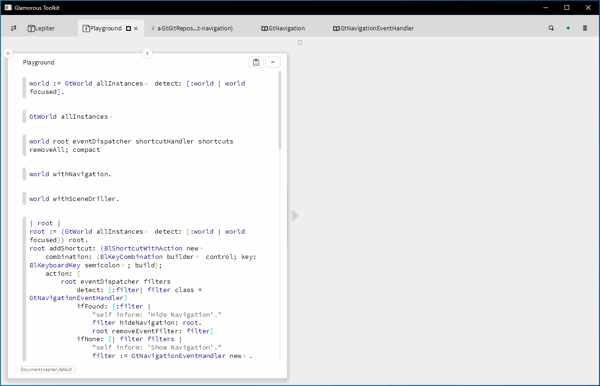

# Glamorous Toolkit (GT) Keyboard Navigation

An enhancement for [Glamorous Toolkit](https://gtoolkit.com) to allow keyboard navigation around the environment

GT's architecture is such that enabling full keyboard navigability (i.e. automating switching tabs, clicking buttons, and in general targeting/focusing every part of the user interface) is straightforward. The "one rendering tree" aspect of the environment allows for all interesting UI "destinations" to be tagged such that they can then be targeted for receiving events, or actioning programmatically. The idea with this feature enables a single top level shortcut to trigger arbitrary UI-related actions. GT also includes full support for UI automation out of the box.



## Load the project

```smalltalk
Metacello new
  baseline: 'GToolkitNavigation';
  reposblitory: 'github://asampal/gt-navigation:main/src';
  load.
```

## Install the shortcut to toggle navigation on/off

Note that the following only installs the shortcut for navigation into the focused GtWorld. You can instead iterate over all worlds to set for all. Ideally the shortcut should be installed whenever a world opens.

```smalltalk
root := (GtWorld allInstances detect: [:world | world focused]) root.
root addShortcut: (BlShortcutWithAction new 
	combination: (BlKeyCombination builder control; key: BlKeyboardKey semicolon; build);
	action: [ 
		root eventDispatcher filters 
			detect: [:filter| filter class = GtNavigationEventHandler] 
			ifFound: [:filter |
				"self inform: 'Hide Navigation'."
				filter hideNavigation: root.
				root removeEventFilter: filter]
			ifNone: [| filter filters |
				"self inform: 'Show Navigation'."
				filter := GtNavigationEventHandler new.
				root addEventFilter: filter.
				filter showNavigation: root.]])
```

## To remove the shortcut, do something like the following:

Since there is no (currently) other shortcut installed at this level, removing all should be safe. 

```smalltalk
world := GtWorld allInstances detect: [:world | world focused].
world root eventDispatcher shortcutHandler shortcuts removeAll; compact
```

## To remove the GtNavigationEventHandler

In case you need to manually remove it run something like the following:

```smalltalk
world root removeEventFiltersSuchThat: [:filter | filter class = GtNavigationEventHandler].
```

## Note

- When you navigate to an editor, the keys you press for the tag will actually be typed in the editor so you'll need to delete them
- For some reason, after matching a tag, you'll need to press the navigation shortcut, Ctrl + ;, twice to bring up the overlays
- Installing the navigation will require some code to be run to load the project and to install a shortcut to toggle navigation on/off
- Tag labels aren't centered in the overlays
- Some UI elements you would probably like to navigate to won't be tagged (currently candidates must be isVisibleInSpace and meet isMemberOf: BrTab,  isKindOf: BrEditor, or isKindOf: BrButton - lots of ideas how this could be enhanced.
- Navigation within a text editor to arbitrary positions (line/word starts and ends), and selecting around these points (a la  Ace Jump/Ace Jump clones) is not yet possible. I intend to have a different shortcut focus in on an element such as an editor or other element with more fine-grained destination points and then display overlays that are rooted on that element.
- The creation of the two-letter tag labels doesn't consider ergonomics or typing efficiency, e.g. certain more frequently navigated to elements could have priority so they're tagged with single letter tags or easy to access key combinations
- The instructions provided in the project's readme only show how to install the navigation shortcut into the currently focused GtWorld

## Roadmap, possible improvements

- Give visual feedback for what's been typed
- Give visual (audio?) feedback around actioning/action point of tag
- Consider ergonomics (choice of one letter tags to most likely targets, choose home row keys as much as possible, etc.)
- Create a pool of ready to use/reuse overlays and simply attach, label, detach them as required, instead of allowing them to be garbage collected and creating memory churn
- Enable multiple top level shortcuts to map to various tagging strategies (e.g. only tabs, or focus on editor then tag text destinations within, etc.)
- Allow tags to be styled (size, color, font, border, etc.)
- Allow UI widgets/elements to specify some kind of navigation metadata so that they can be tagged based on various criteria more easily
- Support more complex actions associated with actioning a tag, e.g. move a tab/widget from one part of the window to another, or select a UI element and invoke some predefined/menu-driven processing against it
